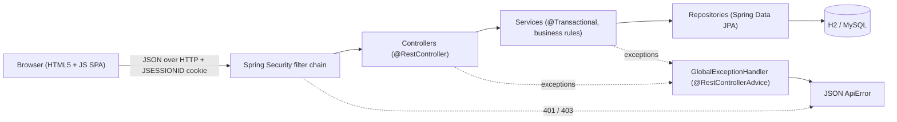

# 🏥 Hospital Management – Enterprise Java Full Stack Capstone

A complete full-stack application: **Spring Boot 3 REST backend** + **responsive HTML5/JavaScript frontend**,
with **session-based authentication**, **role-based authorization**, **global exception handling**
and **OpenAPI/Swagger documentation**.

| Requirement | Implementation |
|---|---|
| Connect frontend UI with Spring Boot REST backend handling authenticated sessions | `static/` UI calls `/api/**` with the `JSESSIONID` cookie; login in `AuthController`, rules in `SecurityConfig` |
| Global exception handling with `@ControllerAdvice` / `@ExceptionHandler` | `exception/GlobalExceptionHandler.java` (`@RestControllerAdvice`) + JSON handlers for 401/403 in `SecurityConfig` |
| Document all endpoints with Swagger / Springdoc at `/swagger-ui.html` | `springdoc-openapi-starter-webmvc-ui`, `OpenApiConfig`, `@Tag` / `@Operation` on every controller |
| Architecture and setup documentation | this README |

## Tech stack
- Java 17, Spring Boot 3.3, Spring Web, Spring Data JPA (Hibernate), Jakarta Validation
- Spring Security (HTTP session + BCrypt, roles `ADMIN` / `STAFF`)
- Springdoc OpenAPI 2.6 (Swagger UI)
- H2 in-memory DB by default, MySQL via profile
- Frontend: HTML5, CSS3, vanilla JavaScript (`fetch`), served by Spring Boot from `src/main/resources/static`

## Architecture



```
src/main/java/com/example/hospital
├── config        SecurityConfig, OpenApiConfig, DataInitializer (seed data)
├── controller    AuthController, PatientController, DoctorController, AppointmentController
├── dto           LoginRequest, AuthResponse, AppointmentRequest/Response, ApiError
├── entity        AppUser, Patient, Doctor, Appointment (+ enums Role, AppointmentStatus)
├── exception     ResourceNotFound/Conflict/BadRequest exceptions + GlobalExceptionHandler
├── repository    Spring Data JPA repositories with @Query methods
├── security      CustomUserDetailsService (loads users from DB)
└── service       PatientService, DoctorService, AppointmentService
src/main/resources/static   index.html, css/styles.css, js/api.js, js/app.js
```

### Data model
`Patient 1 ──< Appointment >── 1 Doctor` (`@OneToMany` / `@ManyToOne`) and a separate `AppUser` table for logins.

### Authentication flow (sessions)
1. `POST /api/auth/login` with `{username, password}` → `AuthenticationManager` verifies the BCrypt hash.
2. The `SecurityContext` is stored in the HTTP session; the server sets an HttpOnly `JSESSIONID` cookie (SameSite=Lax).
3. Every later request carries the cookie automatically; `/api/**` requires authentication.
4. `GET /api/auth/me` lets the UI restore the session after a page refresh; `POST /api/auth/logout` invalidates it.
5. Session expiry (30 min) → API returns `401` → the UI shows the login page again.

### Authorization
| Action | STAFF | ADMIN |
|---|---|---|
| View / create / update patients, doctors, appointments | ✅ | ✅ |
| Delete anything (`DELETE /api/**`) | ❌ 403 | ✅ |

### Global exception handling
All errors share one JSON shape:
```json
{ "timestamp": "...", "status": 400, "error": "Bad Request", "message": "Validation failed",
  "path": "/api/patients", "errors": { "email": "Email must be a valid address" } }
```
| Exception | HTTP status |
|---|---|
| `MethodArgumentNotValidException` (Bean Validation) | 400 + field errors |
| `HttpMessageNotReadableException`, type mismatch, `BadRequestException` | 400 |
| `AuthenticationException` / missing session | 401 |
| `AccessDeniedException` | 403 |
| `ResourceNotFoundException`, unknown URL | 404 |
| `ConflictException` (doctor double-booked), `DataIntegrityViolationException` (duplicate email) | 409 |
| Anything else | 500 (logged, generic message) |

### Business rules
- Appointment time must be in the future.
- A doctor cannot have two non-cancelled appointments at the same time.

## Getting started

**Prerequisites:** JDK 17+ and Maven 3.9+.

```bash
mvn spring-boot:run          # runs with in-memory H2, no setup needed
```
Open **http://localhost:8080** and sign in:

| Username | Password | Role |
|---|---|---|
| `admin` | `admin123` | ADMIN |
| `staff` | `staff123` | STAFF |

Swagger UI: **http://localhost:8080/swagger-ui.html** · OpenAPI JSON: `/v3/api-docs`

> Using Swagger UI: expand **Authentication → POST /api/auth/login**, click *Try it out* and execute with the credentials above.
> The browser stores the session cookie, so all other endpoints then work from the same page.

### Using MySQL instead
```sql
CREATE DATABASE hospital_db;   -- optional, the JDBC URL also creates it
```
Edit `src/main/resources/application-mysql.properties`, then:
```bash
mvn spring-boot:run -Dspring-boot.run.profiles=mysql
```

### Tests
```bash
mvn test
```
Covers: 401 without login, public OpenAPI docs, bad credentials, login → session → protected call, validation error format.

### Docker / live demo
```bash
docker build -t hospital-management .
docker run -p 8080:8080 hospital-management
```
The app reads the `PORT` env variable, so the same `Dockerfile` deploys to Render, Railway or Fly.io. Note: the default H2 database is in-memory and resets on restart – attach a MySQL/PostgreSQL instance for persistent demos.

## API summary
| Method | Endpoint | Description |
|---|---|---|
| POST | `/api/auth/login` | Log in (creates session) |
| POST | `/api/auth/logout` | Log out |
| GET | `/api/auth/me` | Current user |
| GET/POST | `/api/patients` | List (`?q=`) / create |
| GET/PUT/DELETE | `/api/patients/{id}` | Read / update / delete (ADMIN) |
| GET/POST | `/api/doctors` | List (`?q=`) / create |
| GET/PUT/DELETE | `/api/doctors/{id}` | Read / update / delete (ADMIN) |
| GET/POST | `/api/appointments` | List / book |
| GET/PUT/DELETE | `/api/appointments/{id}` | Read / update / delete (ADMIN) |

## Design decisions & limitations
- **Same-origin frontend** – the UI is served by Spring Boot, so no CORS configuration is needed and cookies just work.
- **CSRF protection is disabled** to keep the demo simple; the cookie is `SameSite=Lax` and HttpOnly. For production enable CSRF tokens (`CookieCsrfTokenRepository`) and HTTPS (`cookie.secure=true`).
- **Sessions are in memory** – for multiple instances use Spring Session (Redis/JDBC).
- `spring.jpa.hibernate.ddl-auto=update` is used for convenience; use Flyway/Liquibase in production.
- Demo passwords are seeded by `DataInitializer` – change them before any real deployment.

## Possible improvements
Pagination, doctor availability calendar, JWT for mobile clients, audit logging, Flyway migrations, React frontend.

## Submission checklist
- [ ] Push this project to a **public** GitHub repository
- [ ] Add a screenshot of the UI and of Swagger UI to the README (optional but recommended)
- [ ] Record the video walkthrough (script in `docs/WALKTHROUGH.md`) or deploy a live demo, and add the link here
- [ ] Submit the GitHub repository URL
